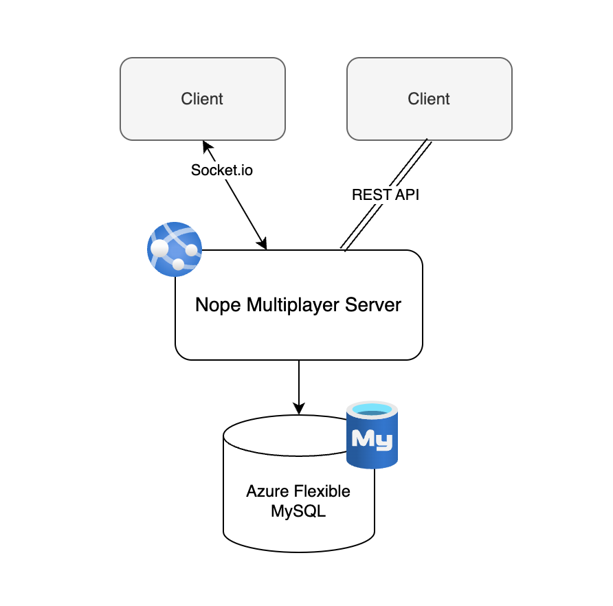
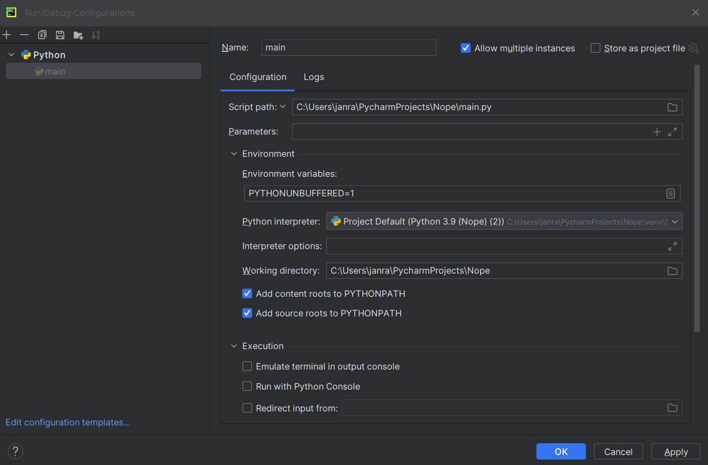
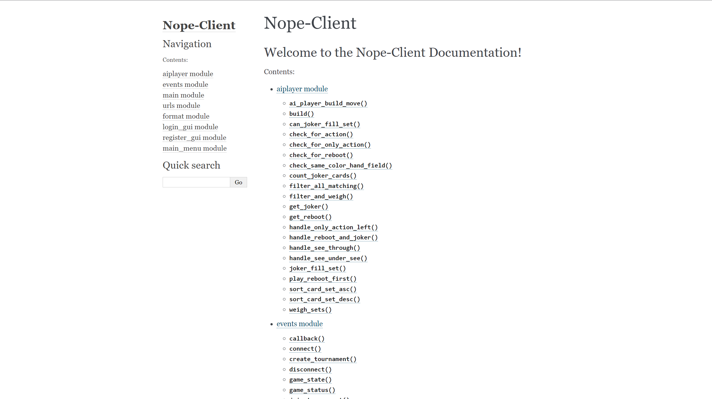
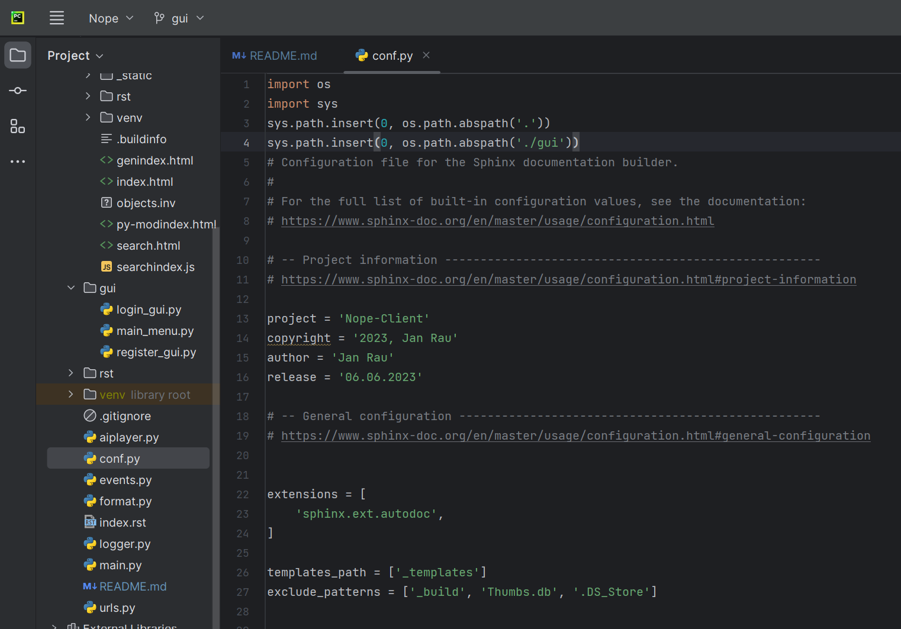

Nope-Client README
-
Learning Journal:
[Learning Journal](https://hallowed-cattle-810.notion.site/Softwareprojekt-Lerntagebuch-e4d82e95510a4af7b133aa02e8aba444?pvs=4)

Project Reflection:
[Project Reflection](https://hallowed-cattle-810.notion.site/Reflexion-Softwareprojekt-f809269a0c7b4210885632b9ec37c6b3)


<!-- Table of Contents -->
# Table of Contents

- [About the Project](#about-the-project)
  * [Tech Stack](#tech-stack)
  * [Features](#features)
- [Getting Started](#getting-started)
  * [Prerequisites](#prerequisites)
  * [Run Locally](#run-locally)
- [Usage](#usage)
  * [Screenshots](#screenshots)

  

<!-- About the Project -->
## About the Project

### Architecture
<div align="center"> 
  
</div>

### Project Structure

```txt
.
│ 
├── assets                  Assets
├── build                   Builds website for Sphinxdoc
│    ├── _static            CSS and JS Files   
│    └── rst                HTML Files
├── gui
│    ├── login_gui.py       Login GUI
│    ├── main_menu.py       Main menu GUI
│    └── register_gui.py    Register GUI
├── rst
│    ├── aiplayer.rst       reStructuredText Files Sphinxdoc
│    └── ...
└── .py files               All scripts
    ├── aiplayer.py         AI-Player
    ├── conf.py             config for Sphinxdoc
    ├── events.py           SocketIO events
    ├── format.py           Better output
    ├── logger.py           Logging
    ├── main.py             Main menu
    └── urls.py             Rest-API URLs
```

The browser documentation of the code can be found at:
``../build/index.html``
or under: [Documentation](https://nope-client-doc-sp.w3spaces.com/)

The documentation was created using Sphinx: [Sphinx](https://www.sphinx-doc.org/en/master/)

<!-- Knockout Card Game - Semester Project -->
### Nope Card Game - Semester Project
### Introduction
Welcome to our semester project on the Nope Card Game! In this project, we explore the exciting and entertaining world of card games, focusing specifically on the rules and mechanics of the Nope Card Game. Our aim is to provide a comprehensive overview of the game, its components, setup, gameplay, and objectives.

### Components
To begin, let's explore the components of the Nope Card Game. The game comprises a total of 104 cards, each serving a unique purpose. These cards include:

- 4 Joker cards
- 14 Action cards
- 4 Restart cards
- 4 Insight cards
- 6 Choice cards
- 66 Two-color cards (24 cards with numbers 1, 2, and 3 in each color combination)
- 20 Solid color cards (8 cards with numbers 1 and 2, and 4 cards with the number 3 in Red, Green, Blue, and Yellow)

### Objective
In the Nope Card Game, your objective is simple: be the last player standing with cards in hand. It requires strategy, cunning, and a bit of luck to outmaneuver your opponents and secure victory. Keep your wits about you and eliminate your opponents one card at a time.


<!-- TechStack -->
### Tech-Stack

### Client
[](https://skillicons.dev)

### Server
[](https://skillicons.dev)

### Database

[](https://skillicons.dev)


<!-- Features -->
### Features

- Easy to use
- Readable Code
- Play Online
- Play locally
- Documentation

## AI-Player
This game is played automatically with an ai-player. 
To build a set and make a move, the ai-player has to follow some conditions:

- Play ``Two-Color cards`` first, ``One-Color cards`` second and ``Action cards`` last.
- If only ``Action cards`` left, play ``see-through`` if possible, play ``reboot next``, play ``joker`` last
- If ``top-card`` has value 3, and I can build a set but i have a ``reboot`` on hand, play ``reboot``
- Only play ``see-through`` or ``joker`` if other cards on hand don't fit ``top-card`` color
- Must play ``joker`` if ``action cards`` only ones left and they can fill a set
- Must play ``reboot`` if ``see-through`` can't be played and ``joker`` can't fill a set
- If opponents cards number >= 4 sort move ascending so highest value card will be ``top-card``
- If opponents cards number < 4 sort move descending so lowest value will be ``top-card``
- ``Joker-weight = 50``, ``Two-Colored-weight = 30``, ``Single-Colored weight = 20``
- Set with highest weight will be played
- Since I only play ``see-through`` if i have to and ``reboot`` if a special case is needed, they don't have weights

## Events / Client-Server Communication

### Client-Side

- `login(name, password)`: Handles client login.
- `registration(name, password, firstname, lastname)`: Handles client registration.

### Server-Side

- `connect()`: Connects to the server.
- `disconnect()`: Disconnects from the server.
- `callback(data)`: Prints data on acknowledgment.
- `player_info(data, _)`: Prints player info received from the server.
- `tournament_info(data, _)`: Prints tournament info received from the server.
- `match_info(data, _)`: Prints match info received from the server.
- `list_tournaments(data, _)`: Prints a list of tournaments received from the server.
- `make_move(data)`: Initializes the AI-player move based on the game state.
- `game_state(data, _)`: Prints the current game state received from the server.
- `game_status(data, _)`: Prints the game status and winner received from the server.

### Client-Side to Server-Side Communication

- `create_tournament(num_best_of_matches)`: Creates a tournament with the specified number of max matches.
- `join_tournament(tournament_id)`: Joins a tournament with the given ID.
- `leave_tournament()`: Leaves the current tournament.
- `start_tournament()`: Starts the current tournament if successful.


## Format

### `print_move_formatted(move, prefix="")`

Prints a formatted move for clearer output.

- `prefix`: (optional) A string to add before the move print.
- `move`: The move to print.


### `print_hand_formatted(hand, opp_hand_size)`

Prints a formatted hand for clearer output.

- `opp_hand_size`: The number of cards the opponent has.
- `hand`: The hand to print.

### `print_top_card_formatted(top_card, prefix="")`

Prints a formatted top-card for clearer output.

- `prefix`: (optional) A string to add before the top-card print.
- `top_card`: The top-card to print.

### `print_menu()`

Prints the menu options for the game.

### `add_entry(entry)`

Adds an entry to the game data.

- `entry`: The entry to add.

### Colors

To use the utility functions, include the `Color` class for text colors and formatting. The `Color` class provides ANSI escape codes for different color variations.

## Main
### `tournament_menu()`

Displays the main menu for the game, allowing users to create tournaments, join tournaments, leave tournaments, start tournaments, and disconnect from the server.

### `login_menu()`

Displays the login and registration menu, allowing users to log in to the server or register a new user.

## URLs

### Rest-API Endpoints


### Player Endpoints

- **Player URL:** `https://nope-server.azurewebsites.net/api/player/{spielername}`
- **Player Stats URL:** `https://nope-server.azurewebsites.net/api/player/{spielername}/stats`
- **Player Tournament URL:** `https://nope-server.azurewebsites.net/api/player/{spielername}/tournaments`
- **Player Tournaments Won URL:** `https://nope-server.azurewebsites.net/api/player/{spielername}/tournaments/won`
- **Player Tournaments Hosted URL:** `https://nope-server.azurewebsites.net/api/player/{spielername}/tournaments/hosted`
- **Player Tournaments Stats URL:** `https://nope-server.azurewebsites.net/api/player/{spielername}/tournaments/statistics`
- **Player Matches URL:** `https://nope-server.azurewebsites.net/api/player/{spielername}/matches`
- **Player Matches Won URL:** `https://nope-server.azurewebsites.net/api/player/{spielername}/matches/won`
- **Player Games URL:** `https://nope-server.azurewebsites.net/api/player/{spielername}/games`
- **Player Games Won URL:** `https://nope-server.azurewebsites.net/api/player/{spielername}/games/won`

### Tournament Endpoint

- **Tournament URL:** `https://nope-server.azurewebsites.net/api/tournament/{tunier_id}`
- **Tournament Stats URL:** `https://nope-server.azurewebsites.net/api/tournament/{tunier_id}/statistic`

### Match Endpoint

- **Match URL:** `https://nope-server.azurewebsites.net/api/match/{match_id}`

### Game Endpoint

- **Game URL:** `https://nope-server.azurewebsites.net/api/game/{game_id}`


## Prerequisites

This project uses the SocketIO-Client package

```bash
 pip install "python-socketio[client]"
```

<!-- Run Locally -->
### Run Locally

Clone the project

```bash
  git clone https://github.com/jrau1801/Nope-Client
```

Go to the project directory

```
  Search for either main.py or login_gui.py and run them
```
```
  Login or Register and create or join a tournament
```

For Rest-API URLs
```
  Run urls.py
```
or
[Rest-API Swagger Documentation](https://nope-server.azurewebsites.net/docs/)


<!-- Usage -->
## Usage


<!-- Screenshots -->
### Screenshots

```
To run the game by yourself you'll probably have to change some settings.
In IntelliJ IDEA this is necessary.
```
```
-> Run -> Edit Configurations -> Allow Multiple instances
```


<div align="center"> 
  
</div>

```
Run main.py two times and split them Left/Right for better usage.
```

### Documentation
```
As mentioned before, this project has been documented with Sphinx.
The landing page looks like this:
```
<div align="center"> 
  
</div>

```
Every method and class has been documented.
This is the place to go if you want to understand the code better.
```

```
To run Sphinx you'll need the following command.
And changes to conf.py are needed sometimes, when working with different directories.
Here we added syspaths for the directories we are working in.
```

<div align="center"> 
  
</div>

```bash
sphinx-build -b html . build
```
```
"html" is the format, "." is the source dir and "build" is the target dir
```
